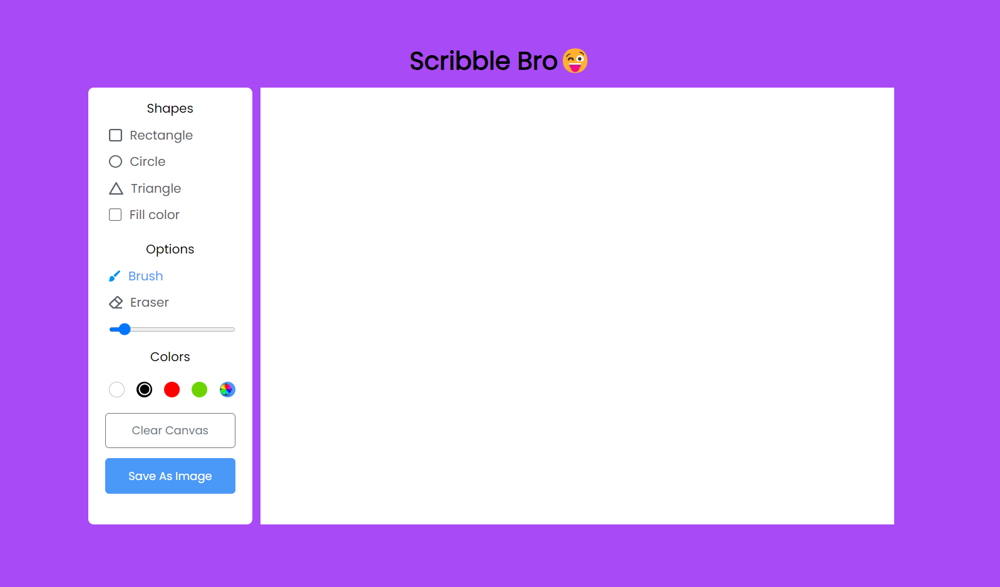

# Scribble Bro😜

Scribble Bro 😜 is a simple drawing and painting web application built using HTML, CSS, and JavaScript. It leverages the HTML5 `<canvas>` element to provide users with a platform for creating digital art and saving their masterpieces. Whether you're an aspiring artist or just looking to doodle, Scribble Bro is here for you.

## Features

- **Drawing Tools**: Scribble Bro offers various drawing tools, including brushes, pens, and an eraser, to let your creativity flow.

- **Color Palette**: Choose from a wide range of colors to make your artwork vibrant and expressive.

- **Undo and Redo**: Made a mistake? No problem. Scribble Bro allows you to undo and redo your actions.

- **Download Your Artwork**: Once you're satisfied with your creation, you can easily download it as an image file to save or share.

## Usage

1. Visit the [Scribble Bro website](https://your-scribble-bro-website-url.com).

2. Select a drawing tool and color from the toolbar.

3. Use your mouse or touchpad to draw on the canvas.

4. Save your masterpiece by clicking the "Download" button.

## Installation

You can host Scribble Bro on your own web server or simply open the `index.html` file in your web browser. No additional installation is required.

## Contributing

We welcome contributions from the community. If you'd like to improve Scribble Bro or add new features, please follow these steps:

1. Fork the repository.

2. Create a new branch for your changes: `git checkout -b feature/your-feature-name`.

3. Make your changes and commit them with descriptive messages: `git commit -m "Add feature: your feature description"`.

4. Push your changes to your forked repository: `git push origin feature/your-feature-name`.

5. Open a pull request against the main repository, describing your changes and why they should be merged.

## License

This project is licensed under the MIT License - see the [LICENSE](LICENSE) file for details.

## Acknowledgments

- Hat tip to the open-source community for inspiring and contributing to the development of Scribble Bro.

---

Happy drawing with Scribble Bro! 🎨
